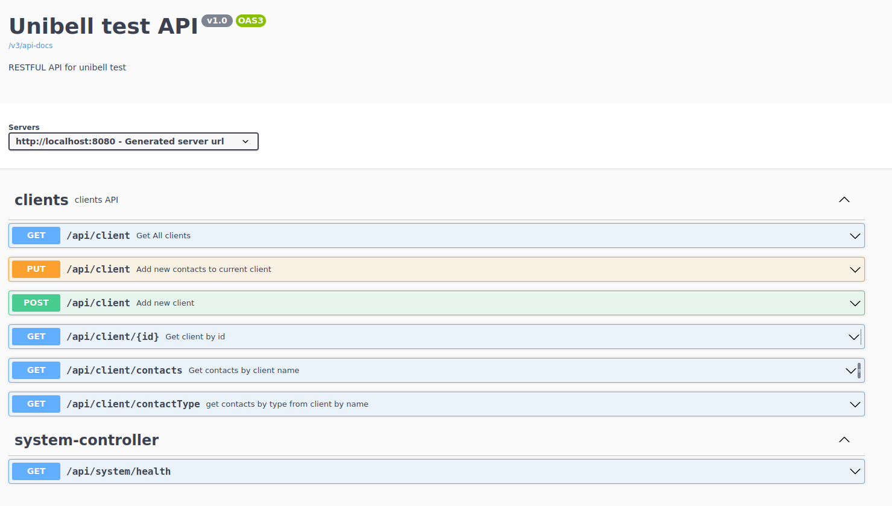

## Тестовое задание для разработчиков бэкенда
### Описание задания
Спроектировать простую БД, обеспечивающую хранение информации о клиентах и их контактой информации.
Каждый клиент характеризуется именем.
Каждому клиенту в соответствие может быть поставлена информация о его контактах: 0 и более телефонных номеров, 
0 и более адресов электронной почты.
Разработать в Spring Framework API, обеспечивающее работу с данной БД.
API должно обеспечивать следующие функции:

1) Добавление нового клиента
2) Добавление нового контакта клиента (телефон или email)
3) Получение списка клиентов
4) Получение информации по заданному клиенту (по id)
5) Получение списка контактов заданного клиента
6) Получение списка контактов заданного типа заданного клиента

### Использованные технологии

* PostgresSQL 15.3
* Spring Boot 3.1
* Spring JPA
* Liquibase 4.20
* Docker
* Lombok
* Hibernate Validator 8.0.1.FINAL
* Junit 5
* Mockito
* H2 Database
* Swagger

### Требование к окружению

* Docker
* Docker-compose

### Запуск проекта
1. Установить Docker
2. Установить Docker-compose
3. Скачать проект из репозитория
4. Через терминал перейти в папку проекта и введите команду*:
```shell
docker-compose --env-file="env.home" up -d
```

5. С помощью команды убедиться, что контейнеры поднялись и состояние было healthy:
```shell
docker ps
```

6. Открыть URL http://localhost:8080/swagger-ui/index.html#/:



*Для запуска проекта со другими переменными среды необходимо создать env.local
и тогда команда для поднятия ресурсов поменяется:
```shell
docker-compose --env-file="env.local" up -d
```


### Контакты
vithag97@mail.ru